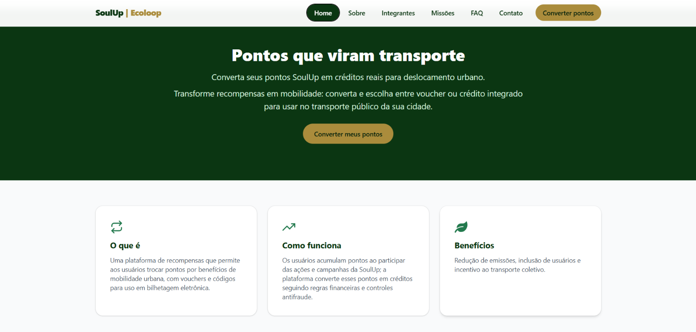
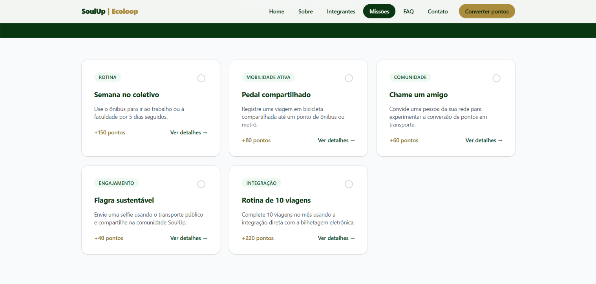
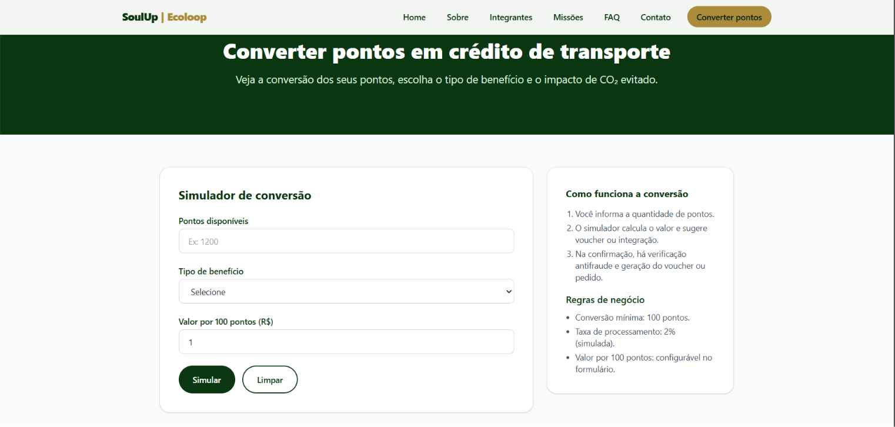

# SoulUp | Ecoloop 🌿🚌

Plataforma que transforma pontos acumulados pelos usuários da SoulUp em benefícios reais de mobilidade urbana — agora reconstruída em **React + Vite + TypeScript**, com **Tailwind CSS**, **React Router** e **React Hook Form**, como parte da Sprint 3 do Challenge FIAP x SoulUp.

---

## 📋 Descrição do Projeto

A **SoulUp | Ecoloop** permite que usuários convertam pontos em créditos de transporte público, escolhendo entre **voucher (QR/boleto)** ou **crédito direto via integração com bilhetagem eletrônica**. O simulador mostra valor bruto, taxa de processamento, valor líquido e o impacto estimado de CO₂ evitado antes de qualquer confirmação. A Sprint 3 também introduz as **Missões sustentáveis**, uma segunda funcionalidade que incentiva ações do dia a dia (ir de ônibus, pedalar até a estação, indicar amigos) em troca de pontos extras, com página de listagem e página de detalhe por missão.

Esta versão migra toda a base estática (HTML/CSS/JS puro) das Sprints 1 e 2 para uma **SPA (Single Page Application)** componentizada, com navegação por rotas, formulários validados e tipagem estática em todo o código.

---

## 🛠️ Tecnologias Utilizadas

| Tecnologia | Uso |
|---|---|
| [React](https://react.dev) | Biblioteca de componentes e UI |
| [Vite](https://vite.dev) | Build tool e servidor de desenvolvimento |
| [TypeScript](https://www.typescriptlang.org) | Tipagem estática em todo o projeto |
| [Tailwind CSS](https://tailwindcss.com) | Estilização utilitária e responsividade (via `@tailwindcss/vite`, sem CSS externo) |
| [React Router DOM](https://reactrouter.com) | Navegação SPA, rotas estáticas e dinâmicas (`useNavigate`, `useParams`) |
| [React Hook Form](https://react-hook-form.com) | Formulários controlados com validação (Contato e Conversão) |
| [React Icons](https://react-icons.github.io/react-icons) | Ícones (Feather e Font Awesome) |
| localStorage | Persistência local do histórico de conversões e missões concluídas |

---

## 📁 Estrutura de Pastas

```
Front-End_Challenge_2026_SoulUp/
├── public/
│   ├── favicon.svg
│   └── icons.svg
├── src/
│   ├── assets/
│   │   └── img/
│   │       ├── Carlos.jpeg
│   │       ├── Gustavo.jpeg
│   │       ├── Miguel.jpeg
│   │       ├── Murilo.jpeg
│   │       └── Thiago.jpeg
│   ├── components/
│   │   ├── layout/
│   │   │   ├── Footer.tsx
│   │   │   ├── Header.tsx
│   │   │   └── Layout.tsx
│   │   └── ui/
│   │       ├── Button.tsx
│   │       ├── Card.tsx
│   │       ├── FaqAccordionItem.tsx
│   │       ├── MissionCard.tsx
│   │       ├── Modal.tsx
│   │       ├── PageHero.tsx
│   │       └── TeamCard.tsx
│   ├── data/
│   │   ├── faq.ts
│   │   ├── missions.ts
│   │   └── team.ts
│   ├── pages/
│   │   ├── Contato.tsx
│   │   ├── Faq.tsx
│   │   ├── Home.tsx
│   │   ├── Integrantes.tsx
│   │   ├── MissaoDetalhe.tsx
│   │   ├── Missoes.tsx
│   │   ├── NotFound.tsx
│   │   ├── Sobre.tsx
│   │   └── Transporte.tsx
│   ├── types/
│   │   └── index.ts
│   ├── utils/
│   │   ├── conversao.ts
│   │   └── storage.ts
│   ├── App.tsx
│   ├── index.css
│   ├── main.tsx
├── .gitignore
├── eslint.config.js
├── index.html
├── package-lock.json
├── package.json
├── README.md
├── tsconfig.app.json
├── tsconfig.json
├── tsconfig.node.json
└── vite.config.ts
```

---

## 🧭 Mapa de rotas

| Rota | Tipo | Página | Observações |
|---|---|---|---|
| `/` | Estática | Home | |
| `/sobre` | Estática | Sobre | |
| `/integrantes` | Estática | Integrantes | |
| `/faq` | Estática | FAQ | Acordeão com `useState` |
| `/contato` | Estática | Contato | Formulário com `react-hook-form` |
| `/transporte` | Estática | Transporte | Simulador (Solução 1) + `react-hook-form` |
| `/missoes` | Estática | Missões | Listagem (Solução 2) |
| `/missoes/:id` | **Dinâmica** | Detalhe da Missão | Lida com `useParams`, navega com `useNavigate` |
| `*` | Coringa | NotFound | Página 404 |

---

## 👨‍💻 Autores e Créditos

Projeto desenvolvido pela turma **1-TDSPI | EcoLoop | Paulista — FIAP**

| Foto | Nome | RM | Turma | GitHub | LinkedIn |
|---|---|---|---|---|---|
|  | Miguel Vieira Martins | 571978 | 1-TDSPI | [Miguel-V-M-dev](https://github.com/Miguel-V-M-dev) | [perfil](https://www.linkedin.com/in/miguel-vieira-martins-598964406) |
|  | Gustavo Neri Andrade | 572722 | 1-TDSPI | [GustavoNeriAndrade](https://github.com/GustavoNeriAndrade) | [perfil](https://www.linkedin.com/in/gustavo-neri-andrade-163795337) |
|  | Thiago Vendrami Luca | 572942 | 1-TDSPI | [Thiagovluca](https://github.com/Thiagovluca) | [perfil](https://br.linkedin.com/in/thiago-vendrami-luca-4892a6409) |
|  | Carlos Americo Machado Brambilla | 571250 | 1-TDSPI | [CarlosAmericoMachado](https://github.com/CarlosAmericoMachado) | [perfil](https://www.linkedin.com/in/carlos-brambilla-b5b971407) |
|  | Murilo da Silva Lourenço | 573959 | 1-TDSPI | [murilojosh](https://github.com/murilojosh) | [perfil](https://www.linkedin.com/in/murilo-lourenço-35250b411) |

---

## 🖼️ Imagens e Ícones do Projeto

- Fotos reais da equipe em `src/assets/img/`, exibidas na página Integrantes e neste README.
- Fotos do projeto em `src/assets/img`, são exibidos nesse README logo abaixo.
- Ícones de interface via **React Icons** (`react-icons/fi` e `react-icons/fa`): menu mobile, GitHub/LinkedIn, status de missão (concluída/pendente), fechar modal, voltar, lixeira do histórico.
- Favicon em `public/favicon.svg`.

---





---

---

## ▶️ Como Usar

### Pré-requisitos
- [Node.js](https://nodejs.org) 18 ou superior instalado (`node -v` para conferir).

### Passo a passo
```bash
# 1. Clone o repositório
git clone https://github.com/Miguel-V-M-dev/Front-End_Challenge_2026_SoulUp.git
cd FFront-End_Challenge_2026_SoulUp

# 2. Instale as dependências
npm install

# 3. Rode em modo desenvolvimento
npm run dev
# abra o endereço mostrado no terminal (ex: http://localhost:5173)

```

### Link do repositório no GitHub
> https://github.com/Miguel-V-M-dev/Front-End_Challenge_2026_SoulUp.git
### Link do vídeo no YouTube
> 
---

## 📬 Contato

Para dúvidas ou suporte, utilize o **email: martins.miguelvieira@gmail.com** ou **telefone: +55 11 99868-6507**, disponíveis também na página de Contato do site, ou fale diretamente com qualquer integrante pelos links acima.

---

<p align="center">© SoulUp — Ecoloop 2026</p>
